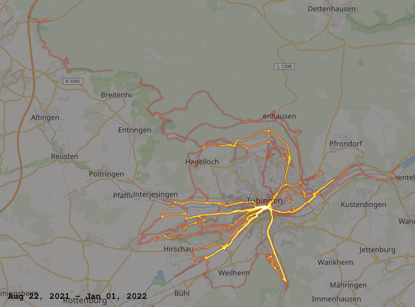

# strava_local_heatmap.py

Python script to create static and animated heatmaps from Strava *.fit* files

## Usage

* Download your bulk data (https://support.strava.com/hc/en-us/articles/216918437-Exporting-your-Data-and-Bulk-Export)
* Install the python dependencies from `requirements.txt`
* Run `python strava_local_heatmap.py`

### Command-line options

```
usage: create_map.py [-h] [--dir DIR] [--filter FILTER] [--year YEAR [YEAR ...]]
                               [--bounds BOUND BOUND BOUND BOUND] [--output OUTPUT] [--zoom ZOOM] [--sigma SIGMA]
                               [--orange] [--alpha] [--gif] [--fps] [--max-time] [--csv]

optional arguments:
  -h, --help            show this help message and exit
  --dir DIR             FIT files directory (default: activities)
  --filter FILTER       FIT files glob filter (default: *.fit)
  --year YEAR [YEAR ...]
                        FIT files year(s) filter (default: all)
  --bounds BOUND BOUND BOUND BOUND
                        heatmap bounding box as lat_min, lat_max, lon_min, lon_max (default: -90 +90 -180 +180)
  --output OUTPUT       heatmap name (default: heatmap.png)
  --zoom ZOOM           heatmap zoom level 0-19 or -1 for auto (default: -1)
  --sigma SIGMA         heatmap Gaussian kernel sigma in pixel (default: 1)
  --orange              Uses the strava background color scheme
  --alpha               Intensity of background color scheme (default: 0.7)
  --gif                 Creates an animated gif rather than static image
  --fps                 Frames per second if gif
  --max-time            Maximum duration of the gif, in seconds
  --csv                 also save the heatmap data to a CSV file
```

Note: `ZOOM` is OpenStreetMap zoom level (the number following `map=` in [www.openstreetmap.org/#map=](https://www.openstreetmap.org))

On the use of histogram equalization: [https://medium.com/strava-engineering/the-global-heatmap-now-6x-hotter](https://medium.com/strava-engineering/the-global-heatmap-now-6x-hotter-23fc01d301de)

## Examples

command|output
-------|------
`python create_map.py --dir data/archive_01-02-2021/activities/ --bounds 48.457 48.605 8.88 9.146 --orange --output outputs/tuebingen_heatmap`|
`python create_map.py --dir data/archive_01-02-2021/activities/ --bounds 48.457 48.605 8.88 9.146 --orange --output outputs/tuebingen_heatmap --gif`|

### Python Requirements

```
numpy
matplotlib
fitdecode
pandas
Pillow
imageio
```

Run `pip install -r requirements.txt` from the repository folder to install.
